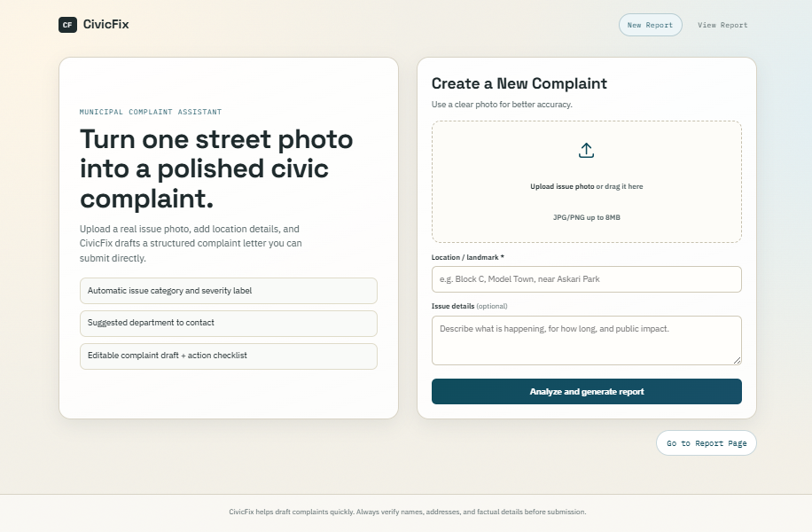
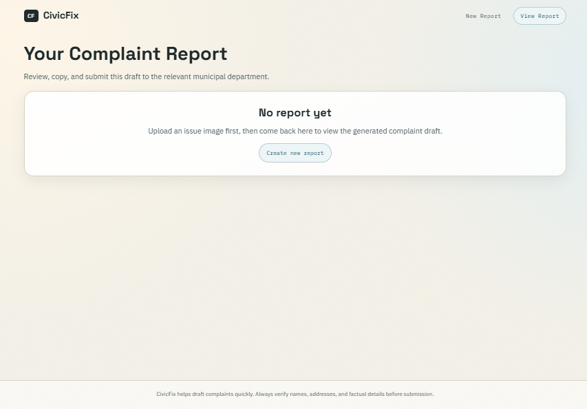
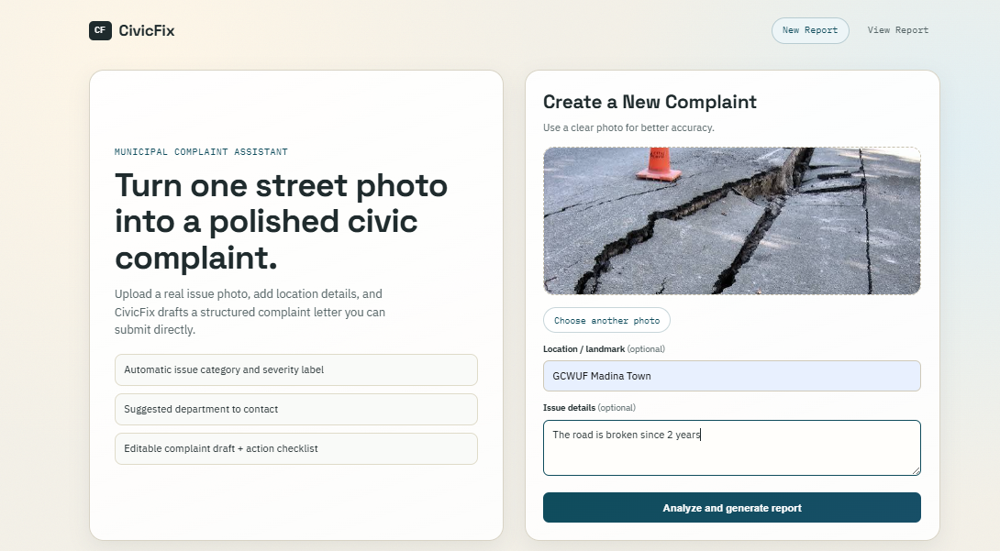
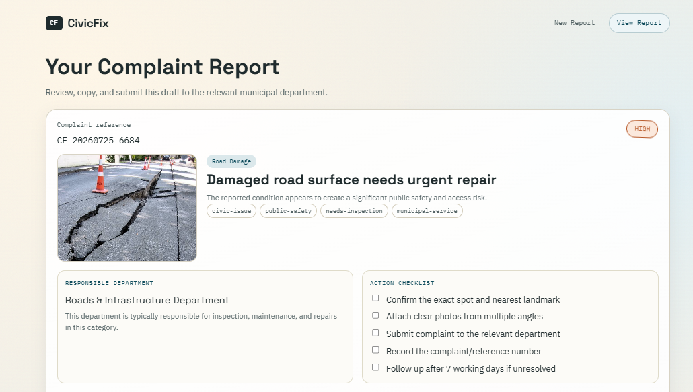
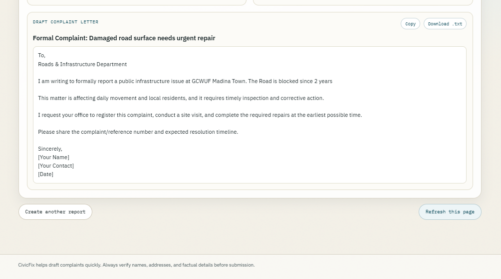

# CivicFix — AI-Powered Municipal Issue Reporter

> **Report it. Route it. Resolve it.**

## Live app

**Deployment:** [https://civicfix-hazel.vercel.app](https://civicfix-hazel.vercel.app)<br>
**Repository:** [github.com/ayeeshailyas/civicfix](https://github.com/ayeeshailyas/civicfix)

## The problem

Whenever people came across any problem such as a road breaks down, a water pipe bursts, or an open manhole creates a hazard, they often do not know which government department is responsible and whom to complain. Even when they do, turning an observation into a clear, formal complaint takes effort. This delay means everyday infrastructure problems can remain unreported and worsen over time.

## The solution

CivicFix makes reporting a civic issue as simple as uploading a photo. Vision AI examines the uploaded image and optional citizen notes, identifies the issue, estimates the safety risk, and routes the complaint to the most relevant department. It then creates a professional English complaint letter that the user can copy or download as a text file.

The goal is to remove administrative friction and help residents take practical action for safer, better-maintained communities.

## Key features

- Upload a photo of a public-infrastructure issue.
- Add a location/landmark and description(optional).
- AI Detect and classify issues such as road damage, drainage problems, water leaks, electrical hazards, sanitation issues, and public-property damage.
- Assign a severity level: **Low**, **Medium**, **High**, or **Critical**.
- Identify the accountable department: **Municipal Corporation**, **WASA / Water Supply**, or **Electricity / Power Department**.
- Generate a formal, editable English complaint draft with a subject line and placeholders for personal details.
- Provide a practical follow-up checklist and a unique complaint reference ID.
- Copy the letter in one click or download it as a `.txt` file.

## App Visuals

| Screen 1 | Screen 2 |
| :---: | :---: |
|  |  |

| Upload an issue | AI-generated report |
| --- | --- |
|  |  |

| Complaint letter |
| --- |
|  |

## How it works

1. The resident uploads an image and add a location or short description(optional)
2. The browser sends the image and notes to `POST /api/analyze` as `multipart/form-data`.
3. The Express backend converts the image to a data URL and sends it with a purpose-built system prompt to OpenRouter.
4. A multimodal vision model returns structured JSON containing the detected category, severity, department, reasoning, tags, complaint letter, and checklist.
5. CivicFix normalizes the response, creates a complaint reference ID, and displays a printable/copyable report.

## AI used in this project

| Area | Implementation |
| --- | --- |
| AI provider | [OpenRouter](https://openrouter.ai/) Chat Completions API |
| Default vision model | `nvidia/nemotron-nano-12b-v2-vl:free` |
| Input | Infrastructure photo plus location and optional citizen notes |
| Output | Strict JSON: category, severity, responsible department, reasons, tags, complaint letter, and checklist |
| Safety/quality rules | The system prompt forces a single department, formal English translation, and elevated severity for fires, sparks, live wires, and immediate hazards |

The main system prompt lives in [`backend/utils/openrouter.js`](backend/utils/openrouter.js) that is: 
`You are CivicFix AI, an expert vision & civic complaint analyzer. Your task is to analyze photos and citizen notes of public infrastructure issues, accurately classify the problem, determine its severity, and draft a formal complaint letter in professional English.


CRITICAL CLASSIFICATION & OVERRIDE RULES
1. DEPARTMENT CLASSIFICATION:
   You MUST assign exactly ONE of the following departments based on the core issue:
   - "Electricity / Power Department": Select this for ALL electrical assets, utility poles, transformers, power meters, high-voltage lines, power outages, electrical fires, or sparks.
   - "WASA / Water Supply": Select this for water leaks, broken pipes or water mains, open manholes, sewage overflow, or drainage blockage. A broken or leaking pipe visible in the image MUST be assigned to WASA.
   - "Municipal Corporation": Select this for roads, potholes, damaged footpaths, garbage/trash accumulation, streetlights, or public parks.

2. SEVERITY LEVEL:
   - "Critical": ANY active fire, sparks, exposed high-voltage wiring, toxic gas leaks, or immediate, severe life safety hazards.
   - "High": Major structural damage, open deep manholes in pedestrian areas, broken power poles, or severe road blockages.
   - "Medium": Moderate potholes, overflowing garbage, broken streetlights, or localized water leakage.
   - "Low": Minor cosmetic damage, faded road signs, or minor littering.

   *STRICT RULE*: If the photo or notes contain FIRE, SPARKS, or DANGEROUS ELECTRICAL WIRES, severity MUST be "Critical" or "High". NEVER set "Medium" or "Low" for hazardous/fire situations.

3. LANGUAGE & TRANSLATION:
   - Citizen descriptions may be provided in Roman Urdu, Hindi, Urdu, or informal slang (e.g., "transformer sar gaya hai", "kuch karo rasta band ha").
   - You MUST translate, refine, and convert the citizen's notes into 100% formal, clear, professional English for the complaint letter body and summaries.
   - NEVER copy-paste raw Roman Urdu or informal slang words into the final letter or summary fields.


JSON OUTPUT REQUIREMENTS
- Respond ONLY with a single valid JSON object.
- Do NOT wrap the JSON in markdown code blocks (no \`\`\`json).
- Do NOT include any intro, outro, or commentary.

REQUIRED JSON FORMAT:
{
  "issue_detected": true,
  "category": "Streetlight & Electrical" | "Road Damage" | "Garbage & Sanitation" | "Water & Drainage" | "Public Property Damage" | "Other",
  "short_title": "5-8 word clear title in formal English describing the issue",
  "severity": "Low" | "Medium" | "High" | "Critical",
  "severity_reason": "1-2 concise sentences explaining why this severity was assigned, referencing specific visible damage or risk.",
  "department": "Electricity / Power Department" | "Municipal Corporation" | "WASA / Water Supply",
  "department_reason": "1 concise sentence stating why this department is responsible for this issue.",
  "english_location_summary": "A short English-only context phrase combining location and issue (e.g., 'IT Park Faisalabad - Severe transformer fire hazard').",
  "tags": ["4-6 short lowercase hyphenated tags, e.g., electrical-hazard, fire-safety, urgent"],
  "complaint_letter": {
    "subject": "Formal and urgent complaint subject line in English",
    "body": "A complete, formal 3-4 paragraph complaint letter written in professional English from a resident to the department head. Translate any citizen notes into clean English. Include square bracket placeholders like [Your Name], [Contact Information], and [Date] where personal details go."
  },
  "checklist": [
    "4-5 clear actionable steps the citizen should take in logical order (e.g., 'Maintain a safe distance from the hazard site', 'Submit this letter to the department helpline', 'Save the reference number')."
  ]
}

If the image DOES NOT show any public infrastructure issue, set "issue_detected": false, but still return the valid JSON structure filling fields with honest reasonable guesses or empty values.`;

 It instructs the model to classify common municipal problems, generate professional English instead of copying informal or Roman Urdu notes, and return machine-readable JSON only. The backend also has normalization and fallback logic in [`backend/routes/analyze.js`](backend/routes/analyze.js) to keep routing and severity dependable.

> AI analysis is an assistive draft. Users should review the final letter, confirm facts and contact information, and follow local emergency procedures for immediate dangers.

## Tech stack

- **Frontend:** HTML, CSS, and vanilla JavaScript
- **Backend:** Node.js and Express
- **Image uploads:** Multer
- **AI integration:** OpenRouter with a vision-capable multimodal model
- **Deployment configuration:** Vercel (`backend/vercel.json`)

## Project structure

```text
civicfix/
├── backend/
│   ├── routes/analyze.js       # POST /api/analyze and result normalization
│   ├── utils/openrouter.js     # Vision-AI prompt and OpenRouter client
│   ├── server.js               # Express API + static-file server
│   ├── vercel.json             # Vercel server configuration
│   └── .env.example            # Required environment variables
├── frontend/
│   ├── index.html              # Upload experience
│   ├── report.html             # Generated complaint report
│   ├── script.js / report.js   # Client-side interactions
│   └── style.css
└── images/                     # README screenshots
```

## Run locally

### Prerequisites

- Node.js 18 or later
- An [OpenRouter API key](https://openrouter.ai/keys) with access to a vision-capable model

### Setup

```bash
git clone https://github.com/ayeeshailyas/civicfix.git
cd civicfix/backend
npm install
```

Copy the example configuration to `.env` and add your key:

```bash
copy .env.example .env
```

```env
OPENROUTER_API_KEY=your_openrouter_key
OPENROUTER_MODEL=nvidia/nemotron-nano-12b-v2-vl:free
PORT=5000
```

Start the server:

```bash
npm start
```

Open [http://localhost:5000](http://localhost:5000). The same Express server delivers both the UI and API, so no separate frontend server or CORS setup is required for local development.

## Deploy to Vercel

1. Import this repository into Vercel and set the project root directory to `backend`.
2. Add `OPENROUTER_API_KEY` in **Project Settings → Environment Variables**. Never commit this key.
3. Optionally set `OPENROUTER_MODEL`, `OPENROUTER_FALLBACK_MODEL`, `OPENROUTER_SITE_URL`, and `OPENROUTER_APP_NAME`.
4. Deploy. Vercel uses [`backend/vercel.json`](backend/vercel.json) to run the Express server, which serves the frontend and `/api/analyze` from one origin.
5. Copy the resulting public `https://…vercel.app` URL into the **Live app** section at the top of this README.

## API overview

### `POST /api/analyze`

Accepts multipart form data containing an issue image plus optional description and location fields. Returns a structured analysis and complaint draft.

### `GET /api/health`

Returns a simple JSON health status and the configured model name.

## Privacy and responsible use

- Do not upload sensitive personal documents or images that are unrelated to the civic issue.
- API keys belong only in local/deployment environment variables; `.env` is ignored by Git.
- CivicFix helps prepare a complaint but does not submit it to an authority or guarantee a repair timeline.
